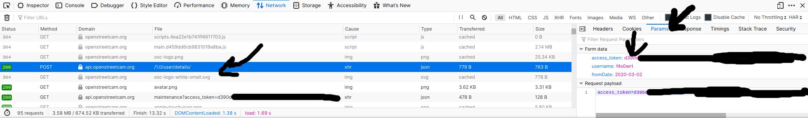

# OSC track export

Scripts that export all tracks, pictures, and data associated with them (except for road sign detections) from an account on OpenStreetCam.

**Tutorial for how to use them is below.**

Log into your account to access unprocessed tracks (if you have uploaded since ~2/16/2020 and need information from your tracks).

Big thanks to the original authors of the osc-gif scripts, those helped a lot.

## Tutorial

1. Figure out the access token when you're logged into your OSC account. In Firefox, you can do that by logging into your OSC account, going to the network tab, then finding the request to `api.openstreetcam.org/1.0/user/details`. Go to Params on the right hand side and copy the access token:

Put that in `osc-export-track.sh`.

2. In Firefox, while you're logged into your OSC account, in the console, run `[...document.links].map(l => l.href).filter((a_url) => a_url.startsWith("https://openstreetcam.org/details")).toString()` and put the output (including quotes in the URLs) in the `URLs` variable in `osc-export-account.sh`. (An example is provided in that file.)

3. In a terminal, type `chmod +x osc-export-account.sh` and run `./osc-export-account.sh`. Wait about 2 hours for the whole thing to finish depending on your internet speed and how many images you have uploaded to your account.
